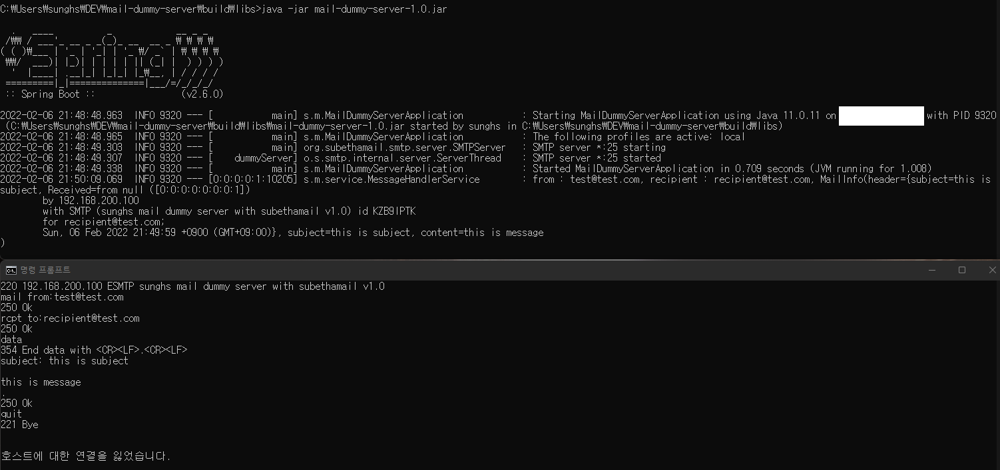

# mail-dummy-server

실제 메일서버에 전송하지 않고 테스트용으로 메일을 수신할 수 있는 더미 서버입니다.

메일 수신 후 해당 내용을 로깅 후 버립니다. 

- 수신한 메일 핸들링 (로깅, 저장, 기타 등등)이 필요한 경우 `MessageHandlerService` 의 `handle` 메소드를 수정하시면 됩니다.
- Accept 규칙에 관해서는 `MessageListenerService` 의 `accept`를 구현하시면 됩니다.


```
smtp:
  server:
    port: 25
    message-size-mb: 16
```
`smtp.server.port` : 메일을 수신 할 port 입니다.  
`smtp.server.message-size-mb` : 최대로 메일을 받을 수 있는 사이즈 입니다.


## environment (2022-02-06)
- Java 11
- Spring Boot 2.6.0
- Gradle 7.3
- Subethasmtp 5.2.4

## example
mail-dummy-server 구동 후 `localhost` 기준으로

`telnet localhost 25`

이후 smtp mail exchange 와 같이 메일을 전송하시면 됩니다.



실제 도메인을 연결하여 테스트 할 경우 네임서버(mx, spf 등) 추가 후 메일 전송하시면 됩니다.

## build & run
```
gradlew bootRun
```